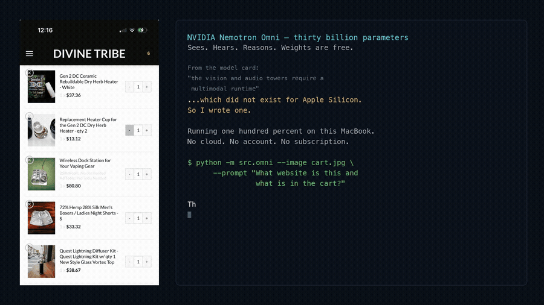

# nemotron-omni-mlx

**Run NVIDIA's tri-modal Nemotron Omni — text + vision + audio — entirely on an Apple Silicon Mac.**

[NVIDIA's Nemotron-3-Nano-Omni-30B-A3B](https://huggingface.co/nvidia/Nemotron-3-Nano-Omni-30B-A3B-Reasoning-BF16)
is an open-weights model that sees, hears, and reasons. A 4-bit MLX quantization already exists
([mlx-community, by yayr](https://huggingface.co/mlx-community/NVIDIA-Nemotron-3-Nano-Omni-30B-A3B-4bit)),
but as that model card notes, only the **text backbone** loads with standard MLX tooling:

> The vision and audio towers require a multimodal runtime that implements the C-RADIO ViT-H and
> Parakeet Conformer forward passes.

This repo is that runtime, in pure MLX. The vision tower, the audio tower, the processor, and the
token splicing — all ported from NVIDIA's reference implementation and **verified numerically
against it**, not by vibes.

```
Image:  67.7 tok/s · 22.1 GB peak
Audio:  147  tok/s · 21.0 GB peak
Text:   152  tok/s · 17.9 GB peak
                          (M5 Max MacBook Pro, 4-bit LLM + bf16 towers)
```

## See it run

A screenshot of a real store cart, read by the model on a laptop with nothing in the cloud:



▶ **[Watch the full 35-second demo, with narration](https://nicedreamzwholesale.com/2026/07/16/nvidia-nemotron-omni-mlx-apple-silicon-vision-audio-runtime/)** — or grab the [mp4](https://github.com/nicedreamzapp/nemotron-omni-mlx/raw/main/docs/nemotron-omni-mlx-demo.mp4) directly.

The write-up on that page covers why this port exists, what the parity numbers mean, and the
three traps worth knowing before you attempt it yourself.

## Parity — verified, not claimed

Every component is tested against NVIDIA's PyTorch reference on the same inputs with the same
weights. `pytest tests/` — **23/23 passing**.

| Component | Compared against | Result |
|---|---|---|
| Audio tower | `transformers` ParakeetEncoder + NVIDIA `SoundProjection`, CPU fp32 | cos **0.99999130** (min/frame) |
| Audio frontend | log-mel features | max &#124;Δ&#124; **8.1e-6** |
| Vision tower | `nvidia/C-RADIOv4-H` via `trust_remote_code`, CPU fp32 | cos **0.99996227** (min/token) |
| Vision tower, MLX CPU stream | same | **1.00000000** — graph-exact |
| Processor | NVIDIA's reference processor | token ids **exact**, pixels max &#124;Δ&#124; **1.55e-06** |

The GPU-vs-CPU gap on vision is Metal's lossy fp32 matmul (~7.7e-4 rel. vs a float64 ground
truth, where torch-CPU and MLX-CPU both sit at ~1.3e-6) — not a porting error. The
`test_cpu_stream_is_graph_exact` test locks that down as a regression guard.

## Install

Requires an Apple Silicon Mac with ≥32 GB (the model needs ~22 GB at peak).

```bash
git clone https://github.com/nicedreamzapp/nemotron-omni-mlx
cd nemotron-omni-mlx
pip install -r requirements.txt
```

Then fetch the weights (~19 GB) and build the filtered text-backbone directory:

```bash
export HF_HUB_ENABLE_HF_TRANSFER=1   # ~30x faster downloads
python scripts/setup_weights.py       # downloads + prepares model-4bit/ and text-only/
```

## Use

```bash
# See
python -m src.omni --image photo.jpg --prompt "What's in this picture?"

# Hear
python -m src.omni --audio clip.wav --prompt "Transcribe this."

# Watch
python -m src.omni --video clip.mp4 --prompt "What happens here?"

# Both at once
python -m src.omni --image photo.jpg --audio clip.wav --prompt "Do these match?"
```

It's a reasoning model — it emits a `<think>` block before the answer. Give it room
(`--max-tokens 900`) or you'll get cut off mid-thought.

## Notes for anyone porting this themselves

Three things cost real time. They're documented at length in `PLAN.md`, but the short version:

1. **The vision tower does not normalize its own input.** `make_preprocessor_external()` turns
   `input_conditioner` into an Identity, so its checkpoint weights are dead. The *processor* must
   apply the CLIP `norm_mean`/`norm_std`. Feed raw `[0,1]` pixels and you get plausible garbage,
   silently.
2. **Parts of `config.json` are vestigial.** `use_thumbnail`, `force_image_size`, and
   `image_tag_type` are ignored by the live code path (only dead code reads them) — it's one
   dynamic-res tile, no thumbnail, not classic InternVL tiling. Trace the code, don't trust the
   config.
3. **`-inf` attention masking NaN-poisons padded audio batches** — fully-masked softmax rows go
   NaN and spread through k/v. NVIDIA's own reference does this: batch two clips of different
   lengths and the shorter one comes back NaN. This port masks with `-1e9` instead (bit-identical
   for valid rows, finite for padded ones).

Also: RADIO has enormous outlier activations (final features |max| ≈ 2370 vs median 2.5). Judge
correctness by cosine similarity, never absolute difference.

## Credit where it's due

- **[NVIDIA](https://huggingface.co/nvidia/Nemotron-3-Nano-Omni-30B-A3B-Reasoning-BF16)** built
  the model and released the weights *and* the reference code openly. This port is a
  transcription of their work into MLX; none of it happens otherwise.
- **[yayr](https://huggingface.co/mlx-community/NVIDIA-Nemotron-3-Nano-Omni-30B-A3B-4bit)** at
  mlx-community did the 4-bit MLX quantization this runs on. Go like that upload.
- **[Apple's MLX team](https://github.com/ml-explore/mlx)**, and whoever contributed
  `nemotron_h` to [mlx-lm](https://github.com/ml-explore/mlx-lm) — the text backbone needed
  nothing from me because of them.

## License

Runtime code: MIT (see `LICENSE`).
Model weights are NVIDIA's and carry the
[NVIDIA Open Model License](https://huggingface.co/nvidia/Nemotron-3-Nano-Omni-30B-A3B-Reasoning-BF16/blob/main/LICENSE)
— this repo ships no weights.

---

Built in Arcata, CA by [Matt Macosko](https://github.com/nicedreamzapp) · Nice Dreamz LLC ·
[more local-AI work](https://nicedreamzwholesale.com/software/)
